# Noite Estrelada — Livraria Online

Plataforma completa de e-commerce para livraria, desenvolvida do zero com foco em usabilidade, design moderno e gestão eficiente. Inclui loja pública para clientes e painel administrativo completo para a operação do negócio.

---

## Visão Geral

A **Noite Estrelada** é uma livraria localizada em Goianésia - GO que vende livros novos e usados. O sistema resolve dois problemas centrais:

1. **Para o cliente:** encontrar e comprar livros de forma prática, sem precisar ir até a loja física
2. **Para a proprietária:** gerenciar estoque, vendas e vendedores de um único painel online

---

## Stack Tecnológica

### Frontend
- **Next.js 15** com App Router
- **TypeScript**
- **Tailwind CSS v4** com design tokens customizados
- **next-themes** para alternância de tema claro/escuro
- **Lucide React** e **React Icons** para ícones

### Backend
- **FastAPI** (Python 3.12)
- **SQLAlchemy** (async) + **asyncpg**
- **Alembic** para migrações
- **JWT** para autenticação (telefone + senha)
- **Passlib/bcrypt** para hash de senhas

### Banco de Dados
- **PostgreSQL** hospedado no **Neon** (serverless, produção e desenvolvimento)

### Infraestrutura
- **Docker / Docker Compose** para containerização da API
- **Vercel** (recomendado para o frontend)
- **Render** (recomendado para a API)

---

## Arquitetura do Projeto

```
starry-night-lib/
├── frontend/                  # Aplicação Next.js
│   ├── app/
│   │   ├── (public)/          # Rotas públicas (com Header + Footer)
│   │   │   ├── page.tsx       # Página inicial
│   │   │   ├── novos/         # Livros novos
│   │   │   ├── usados/        # Livros usados
│   │   │   ├── ofertas/       # Ofertas
│   │   │   ├── livros/[slug]/ # Detalhe do livro
│   │   │   ├── como-funciona/ # Como funciona
│   │   │   ├── sobre/         # Sobre a livraria
│   │   │   └── chat/          # Recomendação por IA (em breve)
│   │   ├── admin/             # Painel administrativo (protegido por JWT)
│   │   │   ├── login/         # Login do admin
│   │   │   ├── page.tsx       # Dashboard
│   │   │   ├── livros/        # CRUD de livros
│   │   │   ├── pessoas/       # Gestão de vendedores
│   │   │   └── vendas/        # Registro e gestão de vendas
│   │   └── layout.tsx         # Layout raiz (Providers)
│   ├── components/
│   │   ├── layout/            # Header, Footer, Nav
│   │   ├── catalog/           # BookCard, BookSection, CartDrawer, CatalogPageClient
│   │   ├── admin/             # Sidebar, LivroForm, PessoaForm, VendaForm
│   │   └── ui/                # Button, Input, Select, Table, Modal, Textarea
│   ├── context/               # CartContext, ToastContext
│   ├── services/              # livros, auth, admin/livros, admin/pessoas, admin/vendas
│   ├── types/                 # livro, pessoa, venda
│   └── hooks/                 # useAuth, useToast, useUnsavedChanges
│
└── backend/                   # API FastAPI
    ├── app/
    │   ├── main.py
    │   ├── database.py
    │   ├── models/            # livro, genero, pessoa, usuario, venda
    │   ├── routers/           # livros, admin, auth
    │   ├── schemas/           # Pydantic schemas
    │   ├── core/              # config, security
    │   ├── create_tables.py
    │   └── seed.py            # Admin + gêneros iniciais
    ├── alembic/               # Migrações
    ├── Dockerfile
    ├── docker-compose.yml
    └── requirements.txt
```

---

## Funcionalidades

### Loja Pública

- Catálogo de livros novos, usados e ofertas com filtros por gênero, condição, preço e ordenação
- Busca em tempo real no header com dropdown de resultados (título, autor, thumbnail)
- Página de detalhe de cada livro com informações completas
- Carrinho de compras persistido em `localStorage` com drawer lateral
- Checkout via WhatsApp: mensagem formatada com lista de livros e total
- Tema claro e escuro com alternância no header
- Páginas institucionais: Sobre, Como Funciona, Recomendação por IA (em breve)

### Painel Administrativo

- Autenticação via telefone + senha com JWT (8 horas de sessão)
- Dashboard com métricas resumidas e vendas recentes
- CRUD completo de livros (criar, editar, disponibilidade, excluir)
- Gestão de pessoas/vendedores
- Registro e acompanhamento de vendas com status e repasse

---

## Telas do Sistema

### Loja Pública

#### Página Inicial
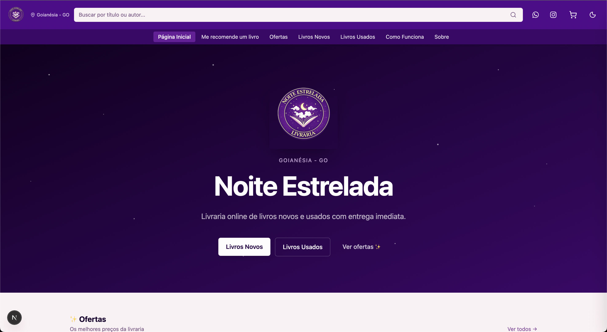

Hero com gradiente roxo escuro, logo da livraria, estrelas decorativas e acesso rápido às seções de livros novos, usados e ofertas. Abaixo, três seções de prévia do catálogo.

---

#### Tema Escuro
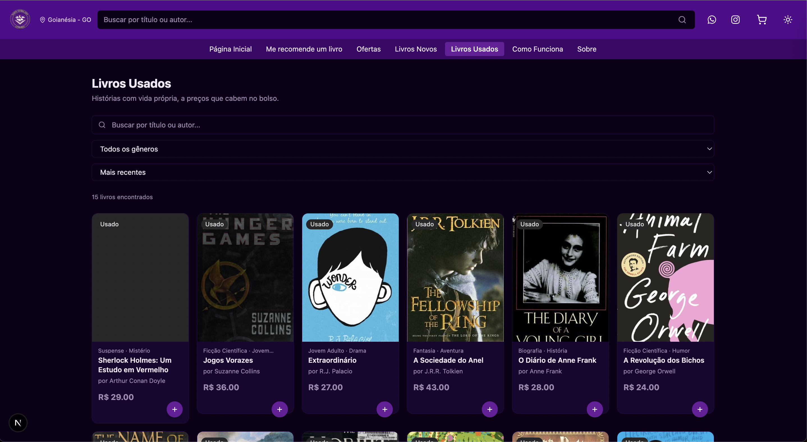

O sistema suporta tema claro e escuro. A alternância é feita pelo ícone no header e persiste entre sessões. O tema padrão é claro.

---

#### Ofertas
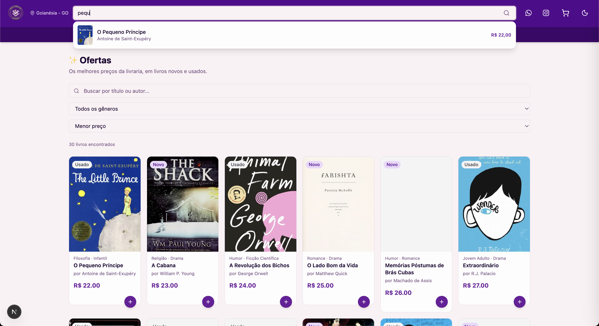

Página de catálogo filtrada por menor preço. Suporta busca por texto, filtro de gênero e ordenação. Grid responsivo de 2 a 6 colunas conforme o tamanho da tela.

---

#### Visualização de Livro
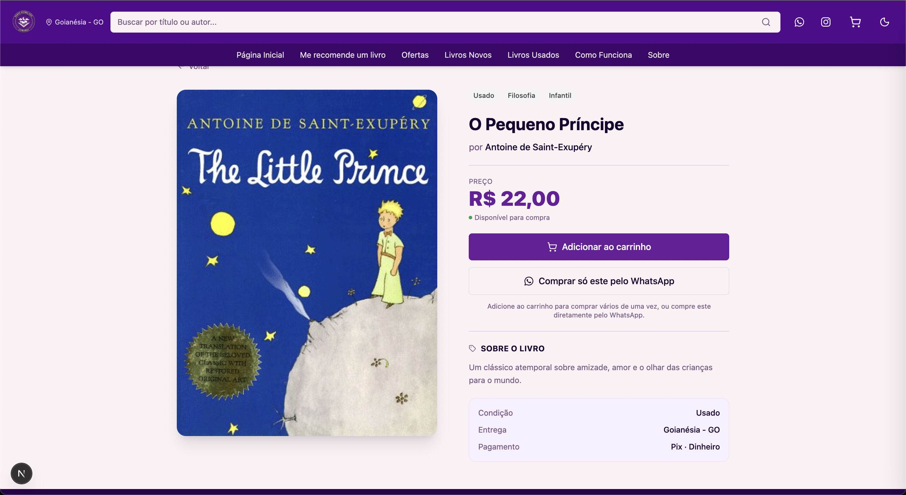

Página de detalhe com imagem em destaque, título, autor, preço, condição e descrição. Botões para adicionar ao carrinho ou comprar diretamente pelo WhatsApp.

---

#### Carrinho
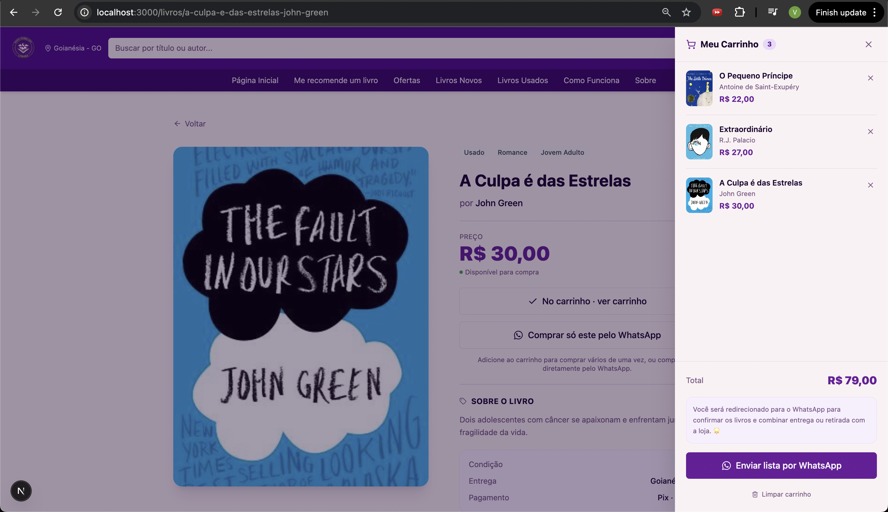

Drawer lateral com lista de livros selecionados, quantidades, total e botão de checkout via WhatsApp. Mensagem formatada enviada automaticamente com os detalhes de cada livro.

---

#### Como Funciona
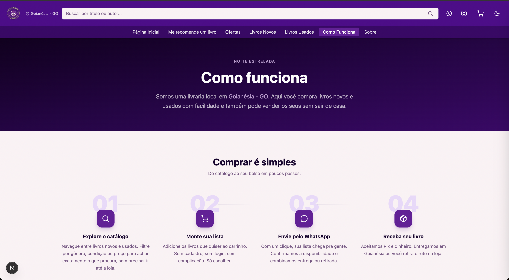

Página que explica o processo de compra em 4 passos e o modelo de venda: o vendedor cadastra o livro pelo WhatsApp, a Noite Estrelada publica no catálogo e só busca o livro quando houver um comprador confirmado. Inclui seção de FAQ com accordion.

---

#### Sobre
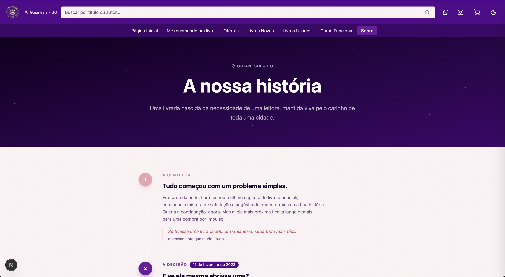

Timeline narrativa com a história da livraria: da ideia inicial à pausa e ao retorno. Cards de dados atuais e mensagem da fundadora.

---

#### Recomendação por IA
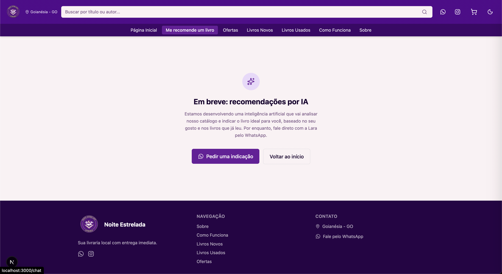

Página "em breve" que apresenta a funcionalidade futura: uma IA que analisará o catálogo e recomendará o livro ideal com base no gosto do usuário. CTA direciona para o WhatsApp enquanto o recurso não está disponível.

---

### Painel Administrativo

#### Login
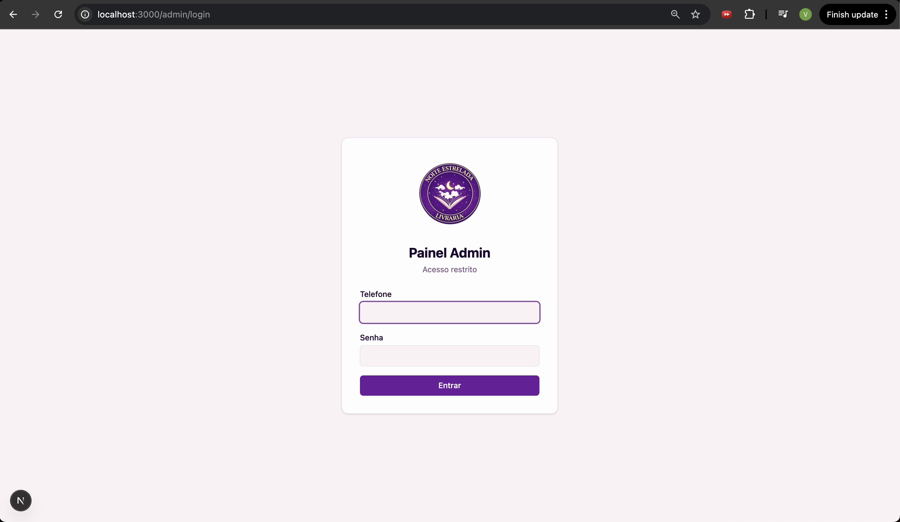

Tela de login do painel administrativo. Acesso por telefone e senha. Rota protegida — redireciona automaticamente para o login caso o token seja inválido ou inexistente.

---

#### Dashboard
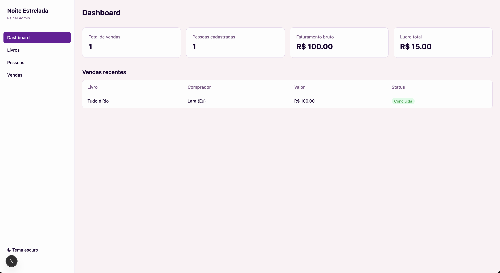

Visão geral do negócio com cards de métricas (livros disponíveis, vendas realizadas, pessoas cadastradas) e tabela com as vendas mais recentes.

---

#### Gestão de Livros
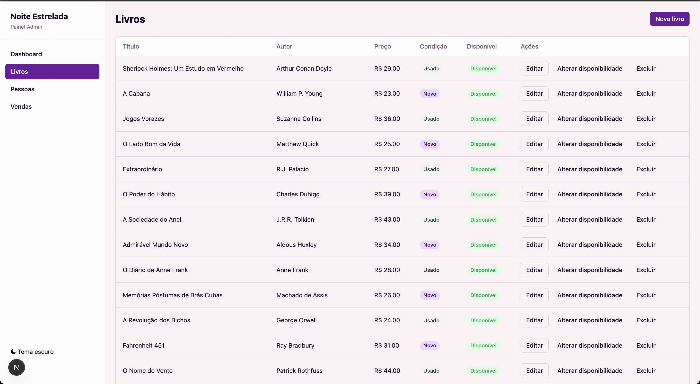

Tabela completa de livros com título, autor, preço, condição e disponibilidade. Ações para editar dados, alternar disponibilidade e excluir. Botão para cadastrar novo livro.

---

#### Gestão de Vendas
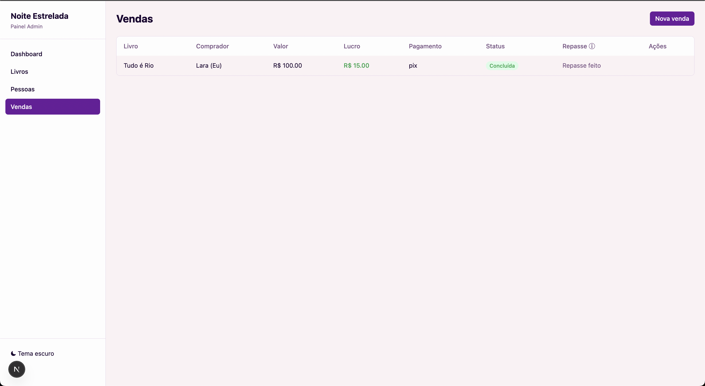

Registro e acompanhamento de vendas com status (pendente, concluída, cancelada), forma de pagamento (Pix ou dinheiro) e controle de repasse ao vendedor.

---

## Como Rodar Localmente

### Pré-requisitos
- Docker e Docker Compose
- Node.js 18+

### Backend

```bash
cd backend
cp .env.example .env
# Preencha as variáveis no .env
docker compose up --build
```

Na primeira execução, o container cria as tabelas e o usuário admin automaticamente.

### Frontend

```bash
cd frontend
cp .env.example .env.local
# Preencha NEXT_PUBLIC_API_URL=http://localhost:8000
npm install
npm run dev
```

Acesse `http://localhost:3000`.

---

## Variáveis de Ambiente

### Backend (`.env`)

| Variável | Descrição |
|---|---|
| `DATABASE_URL` | URL de conexão PostgreSQL (asyncpg) |
| `JWT_SECRET` | Chave secreta para geração dos tokens JWT |
| `JWT_ALGORITHM` | Algoritmo JWT (padrão: HS256) |
| `JWT_EXPIRE_MINUTES` | Duração do token em minutos (padrão: 480) |
| `ADMIN_SENHA` | Senha do usuário administrador |

### Frontend (`.env.local`)

| Variável | Descrição |
|---|---|
| `NEXT_PUBLIC_API_URL` | URL base da API (ex: `http://localhost:8000`) |

---

## Deploy Recomendado

| Parte | Serviço | Observações |
|---|---|---|
| Frontend | Vercel | Detecta Next.js automaticamente |
| Backend | Render | Usa o Dockerfile existente |
| Banco | Neon | PostgreSQL serverless, já configurado |

No Vercel, configure `NEXT_PUBLIC_API_URL` apontando para a URL do Render.
No Render, configure todas as variáveis do `.env`.

---

## Acesso Admin

Após subir o projeto, o usuário admin é criado automaticamente pelo seed com o telefone configurado no código (`62984818938`) e a senha definida na variável `ADMIN_SENHA` do `.env`.

Acesse: `http://localhost:3000/admin`
