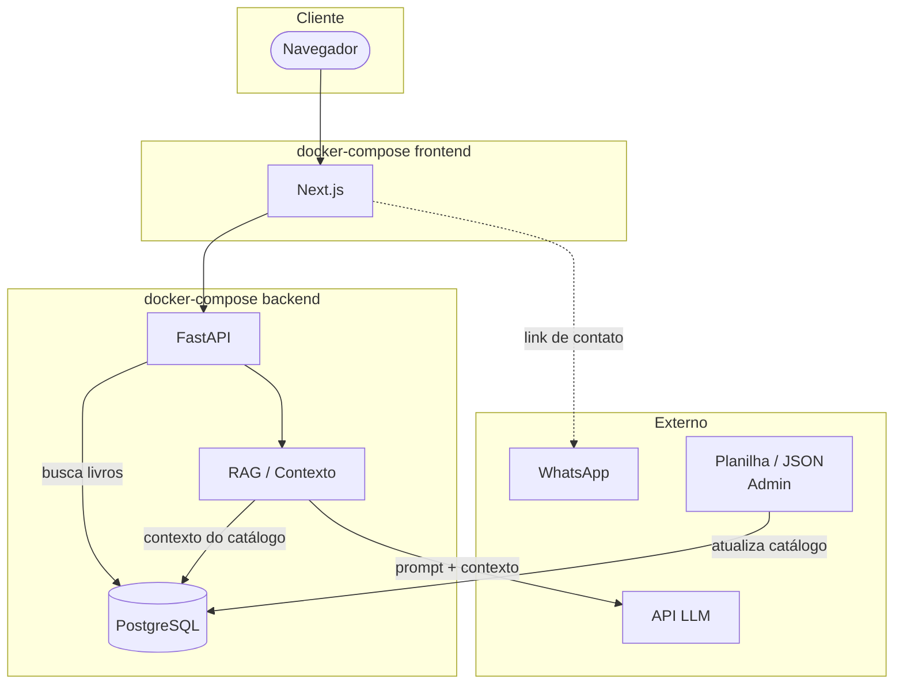

# Arquitetura Técnica — Noite Estrelada

---

## Stack

| Camada | Tecnologia |
|---|---|
| **Frontend** | Next.js |
| **Backend** | FastAPI (Python) |
| **Banco de dados** | PostgreSQL |
| **Chat IA** | API de LLM externa com injeção de contexto (RAG) |
| **Infraestrutura** | Docker Compose (um por serviço) |

---

## Infraestrutura Docker

Cada serviço tem seu próprio `docker-compose.yml`, permitindo rodar e desenvolver de forma independente:

| Serviço | docker-compose | Conteúdo |
|---|---|---|
| **Frontend** | `frontend/docker-compose.yml` | Container Next.js |
| **Backend** | `backend/docker-compose.yml` | Container FastAPI + PostgreSQL |

> O PostgreSQL sobe junto com o backend por ser sua dependência direta.

---

## Diagrama de Componentes

