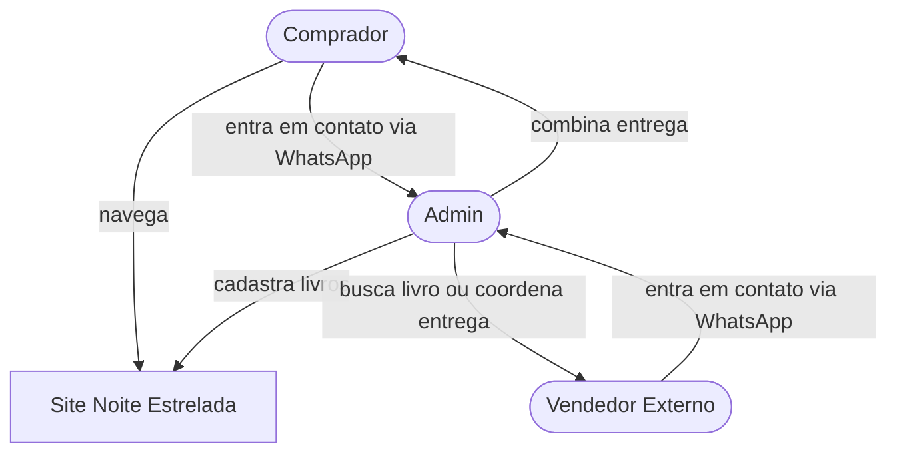

# Definição do Projeto — Noite Estrelada

---

## Visão Geral

A **Noite Estrelada** é uma livraria online de livros novos e usados com foco local (uma cidade). O site funciona como um **catálogo público** — não requer criação de conta. Todo contato de compra e venda é feito via **WhatsApp**.

**Diferencial principal:** entrega imediata, algo que grandes players como Amazon não oferecem localmente.

---

## Escopo

O projeto contempla:
- Vitrine online do catálogo de livros (novos e usados)
- Marketplace local: vendedores externos cadastram livros via contato com o admin, que retém 10% de comissão sobre a venda
- Chat com IA para descoberta e recomendação de livros
- Páginas institucionais (Sobre, Como Funciona, Contato)

---

## Atores

| Ator | Descrição |
|---|---|
| **Admin (dono)** | Opera sozinho. Gerencia o catálogo, recebe pedidos via WhatsApp, realiza ou coordena as entregas. |
| **Comprador** | Visitante do site. Navega no catálogo, usa filtros ou chat, e entra em contato via WhatsApp para comprar. |
| **Vendedor externo** | Quer vender um livro usado. Entra em contato via WhatsApp. O admin cadastra o livro. O livro permanece com o vendedor até a venda. |

---

## Identidade Visual

- **Nome:** Noite Estrelada
- **Cor predominante:** Rosa (tonalidade a definir)
- **Logo:** a criar futuramente

---

## Fora do Escopo (por ora)

- Criação de conta para compradores ou vendedores
- Pagamento online integrado
- Painel admin elaborado
- Livros marcados como "esgotado" (vs. remoção do catálogo)
- Logística própria de entregadores
