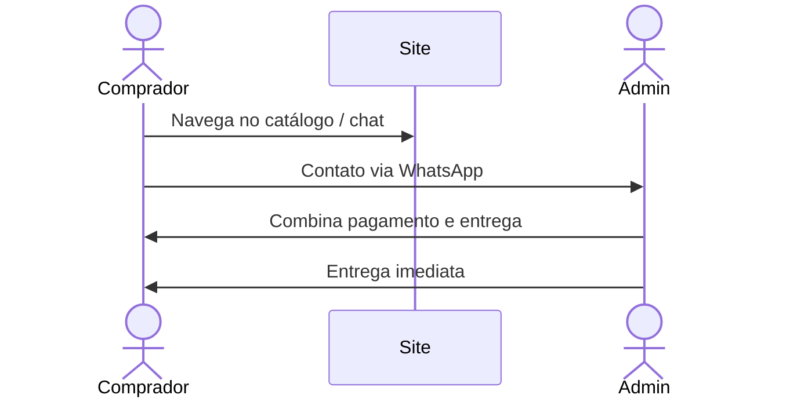
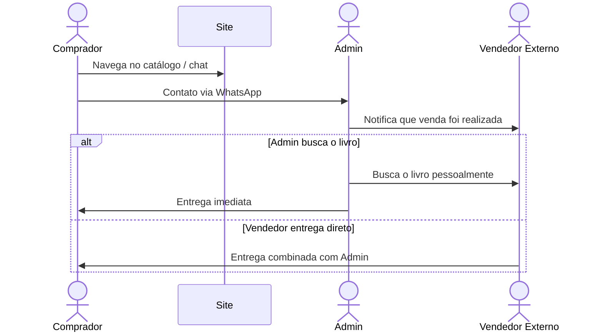

# Refinamento Negocial — Noite Estrelada

---

## Catálogo de Livros

### Campos por livro
- Título
- Autor
- Preço
- Condição (`Novo` / `Usado`)
- Descrição (sinopse)
- Tags de gênero
- Foto(s) — tirada pelo admin ou enviada pelo vendedor externo

### Origem do livro
- **Próprio (admin):** livro do estoque do dono
- **Terceiro (marketplace):** livro do vendedor externo, permanece fisicamente com o vendedor até a venda

### Disponibilidade
- Livros vendidos/esgotados são **removidos do catálogo**
- *Futuro: possibilidade de marcá-los como "Indisponível" ao invés de remover*

---

## Busca e Filtros

Filtros disponíveis no site:
- Título
- Autor
- Faixa de preço
- Condição (Novo / Usado)
- Gênero

---

## Chat com IA

Chat integrado alimentado por API de LLM com **injeção de contexto (RAG)** do catálogo atual. Funcionalidades:
- Responder se determinado livro está disponível
- Recomendar livros com base no gosto pessoal do comprador
- Atuar como assistente de descoberta de livros

---

## Fluxo de Venda

### Livro próprio
1. Comprador encontra o livro no catálogo ou pelo chat
2. Comprador entra em contato via WhatsApp
3. Admin combina pagamento e entrega manualmente
4. Admin entrega o livro (prazo: **imediato**)

### Livro de terceiro (marketplace)
1. Comprador encontra o livro e entra em contato via WhatsApp
2. Admin confirma a venda e notifica o vendedor externo
3. Admin busca o livro com o vendedor **ou** combina entrega direta pelo vendedor (caso a caso)
4. Entrega realizada ao comprador

---

## Pagamento e Comissão

- **Pagamento:** combinado manualmente via WhatsApp (sem integração online)
- **Taxa de entrega:** definida caso a caso (pode ou não existir)
- **Comissão sobre venda de terceiros:** 10% do valor da venda (negociável caso a caso)
- **Repasse ao vendedor:** fora do escopo do sistema (acordado diretamente)

---

## Administração do Catálogo

- Gerenciamento via interface simples (planilha ou JSON como input)
- Dados persistidos em banco de dados
- Banco mantém **histórico** para evitar duplicação de livros
- Sem necessidade de painel admin complexo inicialmente

---

## Páginas do Site

| Página | Descrição |
|---|---|
| **Catálogo** | Listagem, busca e filtros de livros |
| **Sobre** | História e proposta da Noite Estrelada |
| **Como Funciona** | Processo de compra e venda, com FAQ |
| **Contato** | Número de WhatsApp para contato |
